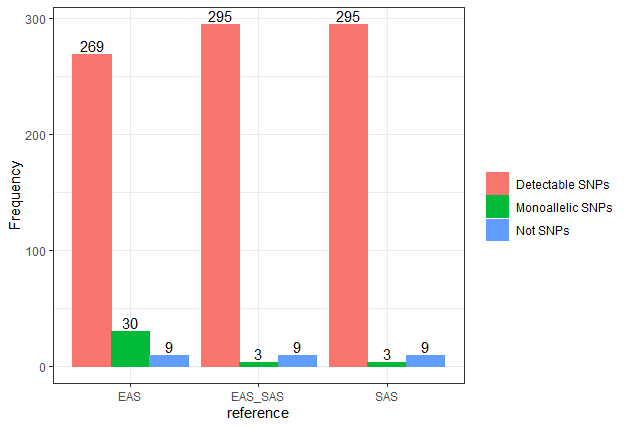
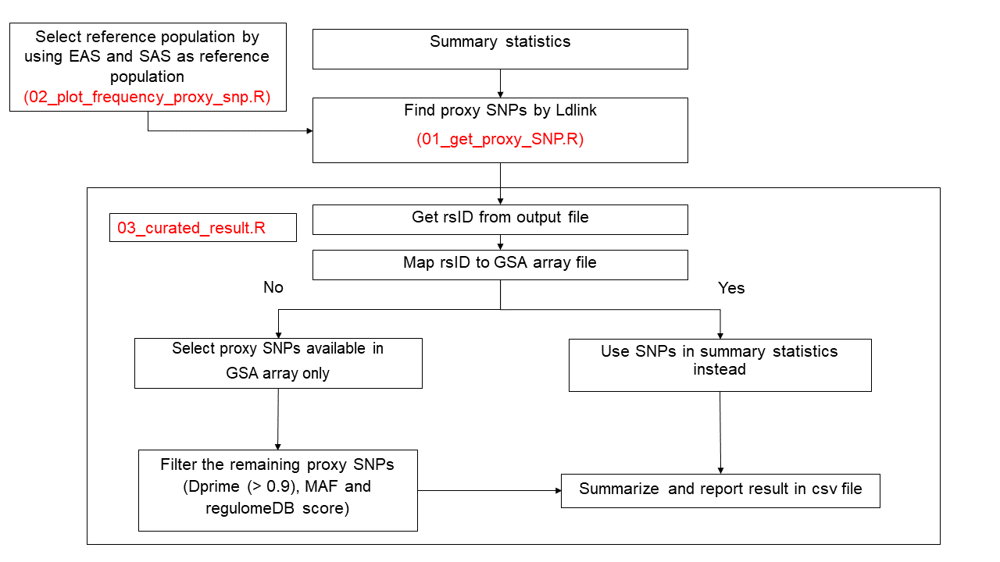
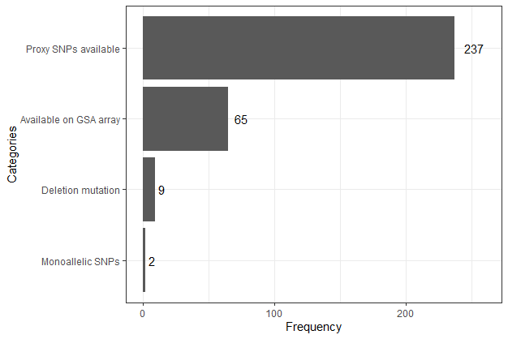

# Update List 
#### 04/12/63 : 17.30-20.30 (3 hours)  
- [x] Check SNPs in summary statistic on GSA array.  
- [x] Get the proxy SNPs by using LDlink pacakge with East Asian as reference background.  
- [x] Get Proxy SNPs of 313 SNPS and reported those are monoallelic and not SNPs.  
- [x] Many proxy SNPs are found but are not select the final ones yets. 

#### 05/12/63 : 16.30-17.30,01.30-02.00 (1.5 hours)   
- [x] Explore proxy SNPs by using three references (SAS,EAS,and EAS+SAS).  

#### 07/12/63 : 8.30-11.30,20.00-22.00 (5 hours)   
- [x] create pipeline

- [x] summarize data 

- [x] Get the optimal proxy SNPs but some of them still have candidate (same dprim, same regulomedb, and same MAF)
(file saved as result/proxy_SNPs_EAS_SAS.csv)

